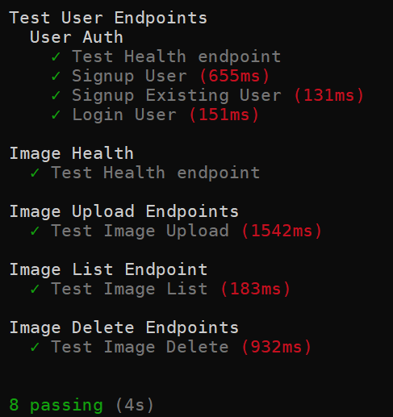

# Shopify Summer '21 Challenge

This is my submission for the Shopify Backend and Production challenge for Summer 2021 roles

To set up the code locally you will require -

```
    - Node.js
    - Firebase Firestore credentials
    - Cloudinary Developer Account
```

To run the code locally, follow the steps below  
1. Run `git clone [repo]`  
2. `cd` into the project repository  
3. Run `npm install` to install all the required dependencies
4. Run `npm start` to run the server (This starts listening on `http://localhost:5000/` by default)

To run the code succesfully, you will need to update the `config/keys.js` file  
To do this, fill out all the details found in `config/keys.example.js` and then rename it to `config/keys.js`  

The required details are  
```
  cloudinary_api_key: "YOUR KEY HERE",
  cloudinary_api_secret: "YOUR SECRET HERE",
  firebaseConfig: {
    apiKey: "API KEY",
    authDomain: "YOUR INFO",
    projectId: "YOUR INFO",
    storageBucket: "YOUR INFO",
    messagingSenderId: "YOUR INFO",
    appId: "YOUR INFO",
    measurementId: "YOUR INFO",
  }
```

# Features

This app allows for the following features -  
- User Sign up using email and password
- Login and secure routes with JWT auth
- Uploading images, and metadata for images (including title, tags etc)
- Deleted any image that the user owns, by providing image ID
- Listing all the images that the current user has stored

# User Flow

- Users first need to sign in through `POST /user/signup` using an email and password input  
- Users can then login using the above mentioned credentials through `POST /user/login` and recieve a `JWT` token to pass in for secure routes

For any of the secure (image) routes, users need to pass in their `JWT` token as a parameter
- To upload an image, users can access `POST /images?secure_token={TOKEN_HERE}`
- To list all images owned by them, users can access `GET /images?secure_token={TOKEN_HERE}`
- To delete an image, users can access `DELETE /images?secure_token={TOKEN_HERE}`

# Testing

The project uses Mocha and Chai to test the endpoints  
The tests can be found under the `test` directory, with two separate files for `/images` and `/user`  
Run the tests using `npm run test`

Output from tests



# TODO